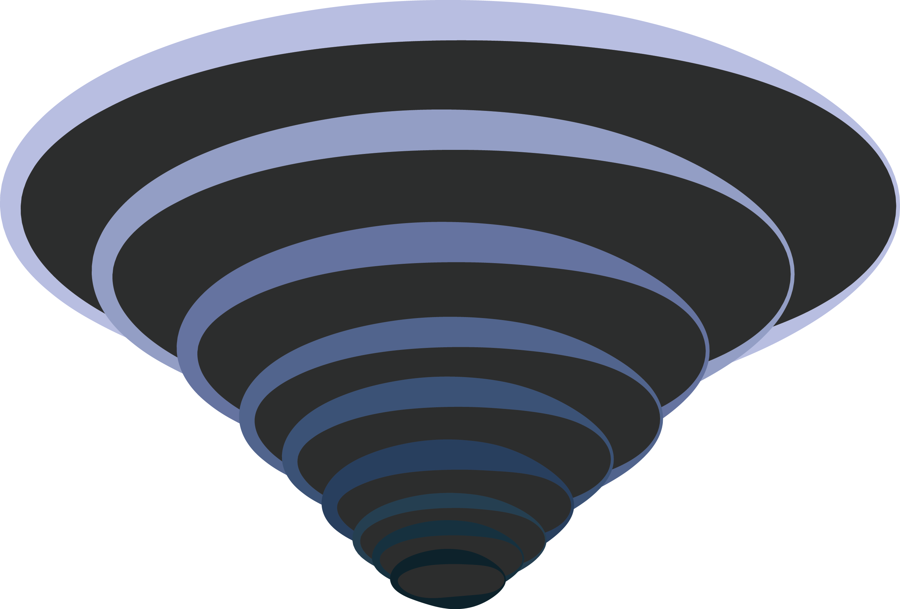

# Topl

An extensible rendering framework in the making, using OpenGL 4.4 and DirectX 11 as graphics backends. Windows is supported with a Linux port in progress.

The Rasteron submodule is required for loading textures, clone the latest version on git: https://github.com/Anton-Os/Rasteron.git

I aim to keep dependencies to a bare minimum and have set out to write as much as possible from scratch.

*See BUILDING.md for building instructions*

Animation, soft-constraint physics, experimental and voxel geometry are some of the things I hope to implement over Topl

*See INFO.md for more details*